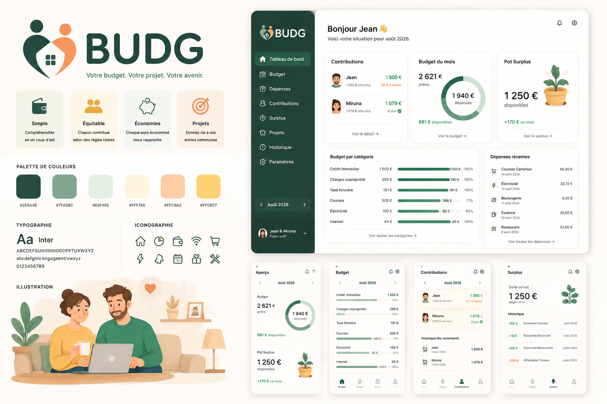

# BUDG

Application locale de budget commun : contributions, enveloppes, dépenses et Surplus.

> Votre budget. Votre projet. Votre avenir.



## Principes

- Simple et compréhensible en un coup d'œil
- Équitable grâce à des règles de contribution explicites
- Local et respectueux des données du foyer
- Orienté économies et projets communs

## Développement

```bash
npm install
npm run dev
npm test
```

Pour l'application desktop, installer les prérequis Rust de Tauri 2 puis lancer `npm run tauri dev`.

## Règle de clôture

Le Surplus transférable est le minimum entre l'économie budgétaire nette et la trésorerie réellement disponible, après exclusion des trop-versés personnels. Une clôture est idempotente et doit être exécutée dans une transaction SQLite.
